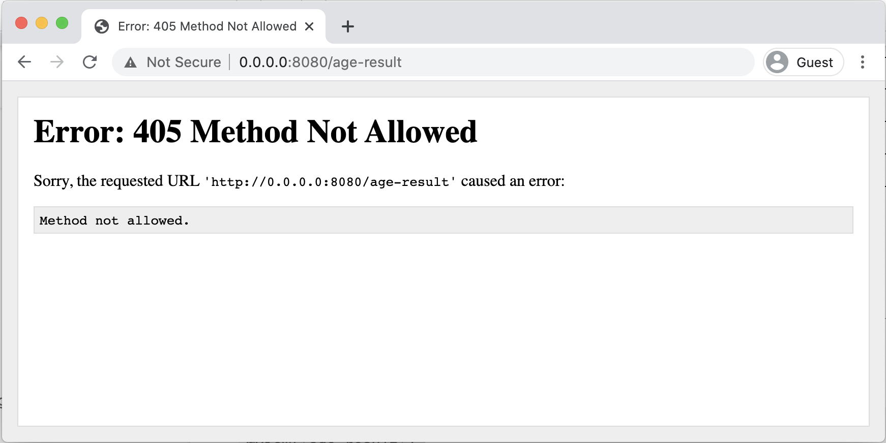
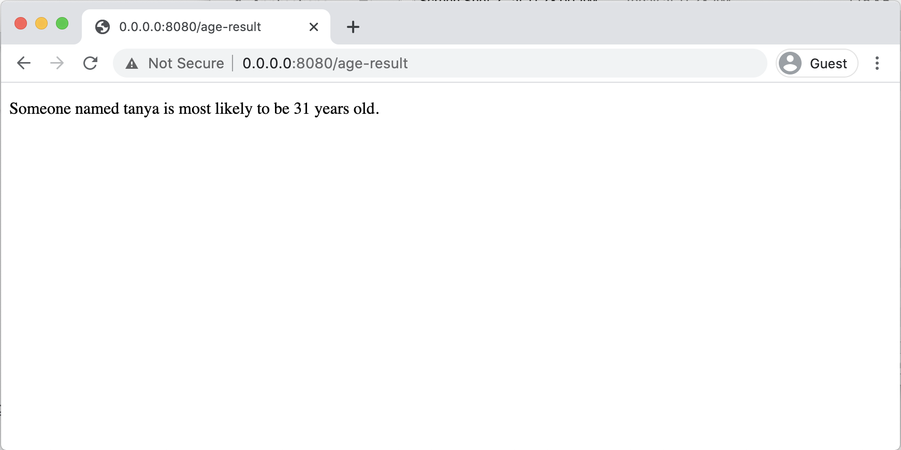
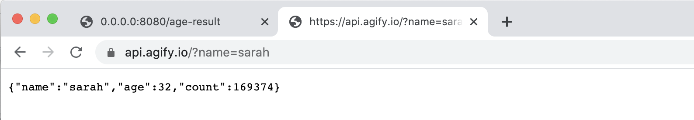
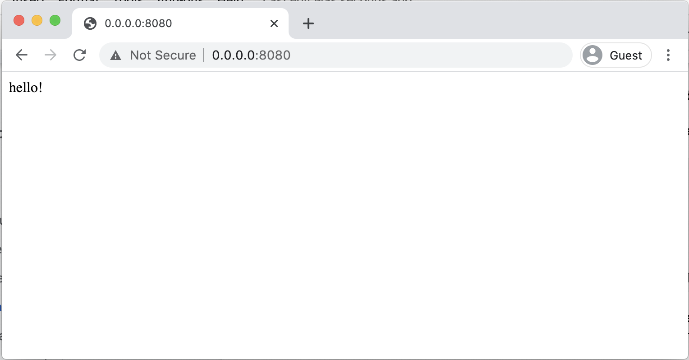

# Websites with Python and Bottle

## Installation


### ▸ Install Python 3


1. Download the newest version of Python 3 from the Python website: \
**https://www.python.org/downloads**
2. Run the Python3 installer. \
Make sure to tick all the extra developer options for Windows!
3. Test that you have the correct version of Python using `python --version` \
This test is different for each computer.

Checklist:


*   Install Python 3
*   Check the installation from the command line


### ▸ Install Visual Studio Code

Download VS Code from **https://code.visualstudio.com**

It's important to note that Visual Studio Code is different from Visual Studio.


*   **Visual Studio** is used for building complex server apps or desktop apps.
*   **Visual Studio Code** is used for building lightweight websites or web apps.

Both are used in the IT industry, but for different purposes. **Visual Studio** is most often used by backend developers using Microsoft languages and frameworks like C# and .Net, and these developers often have additional requirements such as managing multiple projects at a time, integrating with databases, or running automated tests. Visual Studio has a lot of functionality built in and has many configuration options.

**Visual Studio Code** is usually referred to as **VS Code** to reduce confusion. VS Code is usually used by website developers who write HTML, CSS and JavaScript or by people writing small projects using scripting languages and frameworks such Python, JavaScript and NodeJS. VS Code doesn't offer a lot of functionality by default, instead it lets you just install the plugins that you need for your specific projects.

The two apps are both made by Microsoft and both can handle most languages you'll come across in education, but in general it's less overwhelming to start with VS Code and only move to Visual Studio if you have a need. Visual Studio is usually free for education purposes, but VS Code is free for everyone, including industry use.

Checklist:


*   Install VS Code


## 


## Starting a Website

Websites built with Python and Bottle aren't too intimidating and many of the concepts will be familiar to you if you have used Python before.

You still write all your website code in HTML and CSS files, the main difference is that instead of loading those files directly in the browser, you use a Python program to read the browser URLs and decide which pages to show. 

The Python part of the website is just one file. In this first part of the tutorial we will create that website Python file and add some code to start up a web server.

Steps to starting a website:


*   Make a website Python file
*   Add the Bottle run command
*   Run the website


### ▸ Make a website Python file

For websites made with Bottle, you only need one Python file to configure the website. It's possible to add more Python files if you want to, but it isn't required. This Python file will contain a separate function for each page of the website.

The website Python file can be called anything you like, but it's common practice to call it something like **app.py** or **website.py**. The name is only used for running the website from the command line. In this tutorial we'll use the name **website.py**.

Checklist:


*   Make a new project folder and open it in your code editor.
*   Create a **website.py** file which will run your website and all its pages.


### ▸ Install Bottle

Bottle is a Python library that can be installed on your computer using **pip** on the command line. Pip is a **package manager** for Python. A package manager is a program that can install **packages** (you may know them as **libraries**) from the centralized Python package server. 

If your Python command is **python3** then your pip command will be **pip3.**

If your Python command is **python** then your pip command will be **pip**.

Install Bottle using the command line:


```
pip3 install bottle
```


You should get a confirmation message ending with "**Successfully installed bottle-0.12.19**":


```
▶ pip3 install bottle

Collecting bottle
  Using cached bottle-0.12.19-py3-none-any.whl (89 kB)
Installing collected packages: bottle
Successfully installed bottle-0.12.19

```


Checklist:


*   Open the command line panel inside Visual Studio Code
*   Use pip to install the Bottle library
*   Check that you got a success message


### ▸ Add the Bottle run command

The Bottle library for Python lets us run a **web server** using our Python file. Running a web server is what makes the website **dynamic** rather than **static**.

In a **static website**, all the files are written using plain HTML and CSS and the website looks the same for every visitor.

In a **dynamic website**, a program is always running in the background (our website.py program!) which can process data and display different things on the website depending on the data entered by the user.

In your **website.py** import the **run** function and pass it values for **host**, **port**, **reloader**, and **debug.**


```
from bottle import run

# Start the website
run(host='0.0.0.0', port=8080, reloader=True, debug=True)
```


The **run** function accepts many parameters, but the 4 parameters we are using here are:


<table>
  <tr>
   <td><strong>parameter name</strong>
   </td>
   <td><strong>description</strong>
   </td>
  </tr>
  <tr>
   <td>host
   </td>
   <td>The IP Address of the computer or server where the website is being run from. For <strong>localhost</strong> development on your own computer, this should be set to <strong>0.0.0.0</strong>
   </td>
  </tr>
  <tr>
   <td>port
   </td>
   <td>The port number where the website should be available. The port number is related to the type of connection being used, eg. http usually uses port <strong>80</strong> while https usually uses port <strong>443</strong>. For local development of a website, you can choose any 4-digit number you like. In this tutorial we will use <strong>8080</strong> which is a common choice.
   </td>
  </tr>
  <tr>
   <td>reloader
   </td>
   <td><strong>True</strong> to make the website automatically reload when you save your changes. This only reloads the app in the background, you still need to refresh in the browser to see changes.
   </td>
  </tr>
  <tr>
   <td>debug
   </td>
   <td><strong>True</strong> to show detailed error messages when something goes wrong. This is very helpful during development, but should be turned off if the website is ever published online, for security reasons.
   </td>
  </tr>
</table>


Notice that the **host** is a string and the **port** is a number. The host name has dots in it, so it needs to be a string with quote marks around it. The port is a plain number so it doesn't need quote marks. It's important to get these two formatted correctly!

This run command will be set up the same way for every website you create with Bottle, and once you've set it up you don't need to change it again. Set and forget!

Checklist:


*   Import the **run** function from the **bottle** library
*   Configure the **run** function for local development


### 


### ▸ Run the website

After the **run** command is configured, you can start up your website!

From the command line, start your website app the same way you would run any other Python app:


```
python3 website.py
```


If your website has been configured correctly, you will see a message from Bottle telling you that your website is running and the port and host where it can be accessed.


```
▶ python3 website.py

Bottle v0.12.19 server starting up (using WSGIRefServer())...
Listening on http://0.0.0.0:8080/
Hit Ctrl-C to quit.

```


The message "**Listening on http://0.0.0.0:8080/**" is using the **host** and **port** parameters that you passed to the **run **function. This is the URL you can use to view your website in the browser.


_The website can be viewed in the browser at the URL http://0.0.0.0:8080/ but will show a "404 Not Found" error because no pages have been configured yet._

The website runs successfully and an error is shown. The HTTP Error number 404 means "Page not found" and is showing because our website doesn't have any pages added to it yet. In the next step we will add a home page to the project and use it as the default index page of the website.

Checklist:


*   Run the **website.py** program from the command line
*   Check that you get a 404 Error when you load the website in a web browser


## Create a Home Page

In a website made with Bottle, the HTML files can't be accessed directly from the web browser. Instead, you need to use Python to set up a function for each page in the website. These functions run any code thats required for the page and then display the HTML.

In this part of the tutorial we'll explore how to write one of these page functions for the index page of the app, so we'll create an **index.html** page just like you would for a normal website, but that HTML will be displayed using Python.

The steps to adding a home page are:


*   Add an index page function
*   Create an index route
*   Add an index HTML file
*   Display the index HTML


### 


### ▸ Add an index page function

The **website.py** file will have one function for every page in the website. The first page we need to add is the **index** page, which is the first page that will be shown when somebody visits the website.

In your **website.py** add a function for the index page and have it return a simple string:


```
from bottle import run

def index():
    return 'hello!'

# Start the website
run(host='0.0.0.0', port=8080, reloader=True, debug=True)
```


Checklist:


*   Add a new function called "index" in your app
*   Make the function return a string saying "hello"


### 


### ▸ Create an index route

Adding a function to the **website.py** is not enough to solve our 404 error. Using Bottle, we need to make it so that when a person goes to the default index page on our website, the index function gets run.

We can create this link by importing the **route** function from Bottle, and then applying the **route** on a new line above the index function:


```
from bottle import run, route

@route('/')
def index():
    return 'hello!'

# Start the website
run(host='0.0.0.0', port=8080, reloader=True, debug=True)
```


This special **route** function starts with an @ symbol, and it's a type of function known as a **decorator**. A decorator is always used to add some special functionality to a function in your app, and is always used on the line above a function.

In this case the decorator links up the function with a URL path. Decorators are common in many languages, they're not specific to Python. We'll use more decorators** **later in the tutorial.

This process of linking up URL paths with functions is known as **routing**. We are creating a **route** for the default path '/'. In a website you have a **route** for every page of the site.

The '/' route works for someone accessing your website with or without the slash on the end of the url:


<table>
  <tr>
   <td><strong>URL</strong>
   </td>
   <td><strong>route</strong>
   </td>
   <td><strong>function to be run</strong>
   </td>
  </tr>
  <tr>
   <td>http://0.0.0.0:8080
   </td>
   <td>/
   </td>
   <td>index
   </td>
  </tr>
  <tr>
   <td>http://0.0.0.0:8080/
   </td>
   <td>/
   </td>
   <td>index
   </td>
  </tr>
</table>


Now that we have routed the '/' path to the **index()** function, if we visit the index route in the web browser, we will see the output of that function, which is the simple text "hello!":




_Going to http://0.0.0.0:8080 in a web browser will route to the index function and display the text "hello!"._

Checklist:


*   Import the **route** function from the Bottle library
*   Add the **route** decorator to the index function
*   Test the default route in the web browser


### ▸ Add an index HTML file

The **index** function only returns some plain text right now, but usually for a website you want to write your pages using HTML. In Bottle, you can write your pages using HTML and then associate them with a particular function.

Create a new file called **index.html** in your project and add some simple HTML code:


```
<!DOCTYPE html>
<html>

  <head>
    <title>Building Websites with Python and Bottle</title>
  </head>

  <body>
    <h1>Building Websites with Python and Bottle</h1>
    <p>Welcome to my website!</p>
  </body>

</html>
```


Checklist:


*   Create an index.html file in your project
*   Add some simple HTML content to the file


### 


### ▸ Display the index HTML 

In **website.py** add the **view** decorator to the **index** function. Pass in the name of the index page HTML file, without the .html extension. The **index** function will now have two decorators applied:


```
from bottle import run, route, view

@route('/')
@view('index')
def index():
    return 'hello!'
```


The function also needs to be changed so that it doesn't return a string. If you return a string, then the string will always be displayed instead of the HTML. 

Change the **return 'hello!'** of the index function to simply **pass**:


```
@route('/')
@view('index')
def index():
    return 'hello!'
    pass
```


Now when you load the website you should see the HTML from the index.html displayed:


Notice that because we are using a **web server**, the pages are accessed using custom path names instead of using the name of each HTML file because it's the Python code that serves up the file.

Accessing **http://0.0.0.0:8080/index.html** won't work, but we've configured the index route to load the index.html file in the background and display it when someone goes to the '/' index route.

Checklist:


*   Add the **view** decorator to the index function
*   Make sure the file name inside the view decorator matches your index.html file name
*   Change the index function to **pass** instead of returning a string


## 


## Display dynamic content

This is the exciting part we've been working towards in this whole tutorial! So far, everything we have created still works just like a normal website. The power of building a website using Python is that you can make it dynamic!

In this part of the tutorial we'll see how to use Python variables in the HTML by displaying the day of the week, which we'll figure out using Python. As part of achieving this goal we'll also look at how dates work in Python and how you can format them for displaying to a user.

The steps will be:


*   Use variables in HTML
*   Send data to the HTML
*   Get today's date
*   Format a date in Python
*   Display today's day name


### 


### ▸ Use variables in HTML

Because we're using Bottle to serve our website, all HTML files can be used as templates. That means that you can directly use variables in any HTML page that is set up using the **@view** decorator.

To try this out, we'll update the index page to display the day of the week.

In **index.html** add a new paragraph to display the day of the week:


```
<body>
  <h1>Building Websites with Python and Bottle</h1>
  <p>Welcome to my website!</p>

  <p>Today is {{day}}</p>
</body>
```


The part where we want to use a variable is surrounded by two sets of curly brackets. The word in between the curly brackets is the name of the variable you want to display.

If you view this page without the **day** variable set up, you'll get an error 500 Internal Server error, which happens when there is an error in the Python code:




The error specifies that the variable "day" is the problem:


```
NameError("name 'day' is not defined")
```


This error is telling you that the variable "day" needs to be sent to the template.

Checklist:


*   Add a paragraph to the index.html page
*   Use curly brackets and the variable "day" in the HTML
*   View the page and check that you get a NameError for "day" not being defined


### ▸ Send data to the HTML

To send variables to the HTML page, the function for that page needs to return a **dict** with the variable in it. The word **dict** is short for "dictionary" - it's a 


```
@route('/')
@view('index')
def index():
    return dict(
        day = 'Sunday'
    )

```


Now when you view the page you should see the day displayed:


But of course we don't want to update our website every day to display the correct day of the week, so we need a way to send **dynamic** data to the page.

Checklist:


*   Update the index function to return a dictionary
*   Add the day to the dictionary as a hard coded string
*   Check that the day is displayed in the web browser


### 


### ▸ Get today's date

The **index** function is just a normal Python function, so we can add any logic we want inside it. As a first step, we want to get today's real date instead of just hard-coding a day of the week.

We need to import the **date** function from the **datetime** package:


```
from datetime import date
```


The **date** function can then be used in the **index** function to get today's date and pass it to the HTML:


```
@route('/')
@view('index')
def index():
    today = date.today()

    data = dict(
        day = 'Monday'
        day = today
    )

    return data
```


This code will show us today's full date, which is a great start!


Checklist:


*   Import the date function from the datetime library
*   Get today's date in the index function
*   Pass today's date to the HTML page


### 


### ▸ Format a date in Python

Dates in Python can be formatted as strings using the **strftime** function. The name **strftime **is short for "**str**ing **f**ormat **time**". The **strftime** function takes a string parameter where you can pass in any combination of these codes to create a date in the format you want.

For example this code will display the date as "25 January 2021":


```
date = date(2021, 1, 25)
formatted_date = date.strftime('%d %B %Y')
print(formatted_date)
```


If we want to use the **today** date in our website to get today's full name, which format code would we use?


<table>
  <tr>
   <td><strong>code</strong>
   </td>
   <td><strong>meaning</strong>
   </td>
   <td><strong>example</strong>
   </td>
  </tr>
  <tr>
   <td>%a
   </td>
   <td>Weekday as locale’s abbreviated name.
   </td>
   <td>Mon
   </td>
  </tr>
  <tr>
   <td>%A
   </td>
   <td>Weekday as locale’s full name.
   </td>
   <td>Monday
   </td>
  </tr>
  <tr>
   <td>%w
   </td>
   <td>Weekday as a decimal number, where 0 is Sunday and 6 is Saturday.
   </td>
   <td>1
   </td>
  </tr>
  <tr>
   <td>%d
   </td>
   <td>Day of the month as a zero-padded decimal number.
   </td>
   <td>30
   </td>
  </tr>
  <tr>
   <td>%-d
   </td>
   <td>Day of the month as a decimal number. (Platform specific)
   </td>
   <td>30
   </td>
  </tr>
  <tr>
   <td>%b
   </td>
   <td>Month as locale’s abbreviated name.
   </td>
   <td>Sep
   </td>
  </tr>
  <tr>
   <td>%B
   </td>
   <td>Month as locale’s full name.
   </td>
   <td>September
   </td>
  </tr>
  <tr>
   <td>%m
   </td>
   <td>Month as a zero-padded decimal number.
   </td>
   <td>09
   </td>
  </tr>
  <tr>
   <td>%-m
   </td>
   <td>Month as a decimal number. (Platform specific)
   </td>
   <td>9
   </td>
  </tr>
  <tr>
   <td>%y
   </td>
   <td>Year without century as a zero-padded decimal number.
   </td>
   <td>13
   </td>
  </tr>
  <tr>
   <td>%Y
   </td>
   <td>Year with century as a decimal number.
   </td>
   <td>2013
   </td>
  </tr>
  <tr>
   <td>%j
   </td>
   <td>Day of the year as a zero-padded decimal number.
   </td>
   <td>273
   </td>
  </tr>
  <tr>
   <td>%-j
   </td>
   <td>Day of the year as a decimal number. (Platform specific)
   </td>
   <td>273
   </td>
  </tr>
  <tr>
   <td>%x
   </td>
   <td>Locale’s appropriate date representation.
   </td>
   <td>09/30/13
   </td>
  </tr>
</table>


_Table adapted from https://strftime.org/ "A quick reference for Python's strftime formatting directives". This table has been simplified to only include "date" formats and leave out "time" formats._

The **locale** is the configured geographic location of the app. Usually there is a default locale for the app and optionally a locale which is specific to the user. The locale matters when you are formatting dates, times or currency for other languages or countries.

Checklist:


*   Identify which date format code will give the full day name


### ▸ Display today's day name

Using Python's built-in date formatting, we can use the **strftime** function to display the day of the week as a full word. The formatting code for the full day name is **%A**, so this string is passed to the **strftime** function:


```
@route('/')
@view('index')
def index():
    today = date.today()

    return dict(
        day = today
        day = today.strftime('%A')
    )
```


Now the **day** variable is displayed on the page as the day name, and is calculated each time the page is visited by someone:


Checklist:


*   Update the **day** variable to be formatted as the weekday name
*   Check that the weekday name is displayed in the browser


## 


## Add support for CSS and Images

When you're building a website using Python and Bottle, none of the files from the project can be accessed unless they have **routing** set up. That means that for any CSS, JavaScript or image files you need to set up a route in the same way as you would for a page.

These files are known as **static** files. Remember the difference between a **static** website vs a **dynamic** website, from the start of this tutorial?


```
"In a static website, all the files are written using plain HTML and CSS and the website looks the same for every visitor.

In a dynamic website, a program can display different things on the website depending on the data entered by the user."
```


Although we are building a **dynamic** website that can show different content for each user, our dynamic website contains some **static **content which is the same for every user. CSS, JavaScript and image files are not dynamic, they are static.

In a website built with Bottle it is recommended to put all these **static** files in one folder, and then create one route which will work for all static files.

To add a CSS file you will need to:


*   Create a stylesheet
*   Add the stylesheet to the HTML head
*   Create a route for the stylesheet


### 


### ▸ Create a stylesheet

In your project create a new folder called **static**.

In the **static** folder, create a new CSS file called **style.css**:


```
body, html {
  margin: 0;
  padding: 0;
  font-family: sans-serif;
  text-align: center;
  background-color: bisque;
}
```


This is a very basic stylesheet that changes the font to the default sans-serif font and adds a background colour. When the CSS has been set up correctly in Bottle you'll be able to see the background colour change.

Adding a CSS file to the project isn't enough - we also need to load the CSS from the HTML, and add a route using Bottle. You won't see the CSS affecting your page yet!

Checklist:


*   Create a **static** folder in your project
*   Create a new file in **static** called **style.css**
*   Add some simple CSS to the file so you'll be able to see when it's working


### ▸ Add stylesheet to the &lt;head>

In the **index.html**, add the style.css file the same way you usually do for a website:


```
<head>
  <title>Building Websites with Python and Bottle</title>
  <link href="/static/style.css" rel="stylesheet">
</head>
```


If you try to load the website in the browser, the CSS will not work. If you open the developer tools, you'll see that there was a** 404 File not found** error for styles.css, which is the same error we had for the index page before a route was set up for it.

Checklist:


*   Add a &lt;link> tag in **index.html** to load the CSS file
*   Double check the CSS path is correctly set to **/static/style.css**
*   Check the web browser dev tools to see the 404 error


### 


### ▸ Create a route for the stylesheet

Every file in a Bottle website needs to have a route if it needs to be accessed from the web browser. For static files, Bottle has a special function for serving up the files in the correct format, since they can be any kind of file, not just HTML.

Import the **static_file** function from the Bottle library:


```
from bottle import run, route, view, static_file
```


There are usually a lot of static files in a website. You'll definitely have a CSS file, maybe some JavaScript files, and there could be a whole lot of image files too. Instead of setting up a separate route for every single static file in the website, we can create one route which handles all of those files.

Add a route for the **static** folder in your **website.py**:


```
@route('/static/<filepath:path>')
def load_static(filepath):
    return static_file(filepath, root='./static')
```


In the route, instead of using a specific file name, we are using a **pattern**. This route will be used for any file request that matches the pattern.


```
@route('/static/<filepath:path>')
```


*   The requested file path must start with **/static/**
*   Everything after **/static/ **should be captured by the **&lt; > **brackets
*   The bit after **/static**/ should be stored in a variable called **filepath**
*   The variable **filepath** should be the special type **path** to support both files and folder

    ```
def load_static(filepath):
```


*   Pass the **filepath** variable from the route into the function

    ```
return static_file(filepath, root='./static')
```


*   Look for files in the folder called **./static** 
*   Use the **filepath** variable to find a matching file in the folder
*   Return the file as a Bottle **static_file**

These are all the steps you need to set up static file routing in Bottle. You might find that the CSS still doesn't show in the web browser - if so, do a **hard refresh** by holding **Shift** when you click refresh.

Checklist:


*   Import **static_file**
*   Create a route for all files in the **static** folder
*   Check that the CSS is loading in the browser (you might need to hold **Shift** when you refresh)


### 


### ▸ Clear the browser cache

Why do we sometimes need to do a **hard refresh** to see CSS changes in a web browser?

Web browsers usually save a copy of any CSS files they load so that they don't have to get it from the server every time a page is reloaded. Storing files like this is called **caching**. When a file has been stored in the cache, you need to do a **hard reload **of the website to make sure the browser loads the whole website and all its files from the server instead of from the browser cache.

To do a **hard reload** in Google Chrome, hold down the **Shift **key while you click the reload button.

You can see the difference between a normal reload and a hard reload by looking at the Bottle output in the command line. When using a normal reload, only the HTML will be requested from the server. When doing a hard reload both the HTML and CSS will be requested from the server.

Checklist:


*   Try a normal refresh and a hard refresh in Google Chrome
*   Read the server requests in the command line and spot the difference for a hard refresh


## 


## Guess My Age

We'll use a form to ask a user's name, then use a free API to guess their age. This will require adding two new pages to the website. The first page will be a form where we can ask the person's name, and the second page will be for displaying the result of their estimated age.

In this activity you'll also learn about making HTTP requests using Python and how to process JSON data returned from an API.

The steps will be:


*   Create form page HTML
*   Add form page route
*   Create result page HTML
*   Understand the Agify API
*   Make an Agify API request


### 


### ▸ Create form page HTML

The first page we need to create is the form page, where we can ask the user for a name.

Create a new file called **age-form.html** in the project:


```
<!DOCTYPE html>
<html>

  <body>

    <form action="/age-result" method="POST">

      <label for="name">What is your first name?</label>
      <input name="name" type="text">

      <button type="submit">Guess My Age</button>

    </form>

  </body>

</html>
```


Checklist:


*   Make sure the form action and method are spelled correctly
*   Ensure the input element has a name attribute


### 


### ▸ Add form page route

In **website.py**, add a new route for the "Guess My Age" page:


```
@route('/age-form')
@view('age-form')
def age_form():
    pass
```


The page only needs to show the HTML file, it doesn't need to do any processing so the function can just use a **pass**.

Test the page in the browser:




Checklist:


*   Create a new route for the age-form page
*   Test the page in the web browser


### 


### ▸ Create result page HTML

This is the page that will be shown to the user after they submit the form. On this page we want a simple template that will display the **name** that was entered and their estimated **age**:


```
<!DOCTYPE html>
<html>

  <body>

    <p>Someone named {{name}} is most likely to be {{age}} years old.</p>

  </body>

</html>
```


Checklist:


*   Create a new page called **age-result.html**
*   Add a paragraph to the page using two variables **name** and **age**


### 


### ▸ Add result page route

This route will need to match the form **action** attribute from the **age-form.html** page. When the form is submitted, the form data will be sent to this route.

Create a route for the page and put in some placeholder data for the **name** and **age** variables.


```
@route('/age-result')
@view('age-result')
def age_result():
    return dict(
        name = 'unknown',
        age = 'unknown'
    )
```


View the page to ensure it works correctly:


Checklist:


*   Create a new route for the **age-result** page
*   Make sure the route name matches the **action** attribute in **age-form.html**
*   Return a dictionary containing placeholder values for **name** and **age**
*   View the page to ensure it works correctly


### ▸ Access the form data

The route needs to be changed to accept form data.


```
@route('/age-result', method='POST')
@view('age-result')
def age_result():
    return dict(
        name = 'unknown',
        age = 'unknown'
    )
```


After this change, the page can't be accessed directly any more. It **must** be accessed by submitting the form. This makes sure that the page always has the data it needs.




Now that we are using the POST method, we can get the form data.

First, import **request** from the Bottle library:


```
from bottle import run, route, view, static_file, request
```


Then use the **request** to get the name value from the submitted form:


```
@route('/age-result', method='POST')
@view('age-result')
def age_result():
    first_name = request.forms.get('name')

    return dict(
        name = 'unknown',
        name = first_name,
        age = 'unknown'
    )
```


Checklist:


*   Add the **POST** method to the **age-result** route
*   Import **request** from Bottle
*   Get the **first_name** variable from the submitted form data
*   Send the **first_name** to the HTML template


### ▸ Understand the Agify API

An API is an **A**pplication **P**rogramming **I**nterface. When any program, application or platform offers a way for developers to interact with it programmatically using code, the set of interactions that are made available are known as the API.

You can visit the home page for the Agify API at **https://agify.io/**

The Agify API is free to use. You send it a name, and it sends back the likely age of a person with that name. The request looks like a simple URL, and the response is in JSON format.

For this particular API, the way you interact with it is using a URL with a "name" parameter:


```
https://api.agify.io?name=YOURNAME
```


You can test this API directly in your web browser by entering the URL and a name:


The data returned by the API request is in JSON format. In the browser it's showing as plain text, but it can also be formatted in this way to make it easier to read:


```
{
  "name": "sarah",
  "age": 32,
  "count": 169374
}
```


The properties in the response data are fairly simple, but here's a table explaining each of them:


<table>
  <tr>
   <td><strong>property</strong>
   </td>
   <td><strong>description</strong>
   </td>
  </tr>
  <tr>
   <td>name
   </td>
   <td>The name that was requested
   </td>
  </tr>
  <tr>
   <td>age
   </td>
   <td>The estimated age of a person with that name
   </td>
  </tr>
  <tr>
   <td>count
   </td>
   <td>The number of people with that name in the database
   </td>
  </tr>
</table>


 

Checklist:


*   Use the Agify API in a web browser to guess your own age
*   Use the Agify API in a web browser to guess the age of someone you know


### 


### ▸ Make an Agify API request

Install the **requests** library, which makes HTTP requests in Python really easy:


```
pip3 install requests
```


Import the requests library:


```
import requests
```


Make a **get** request to the Agify API and return the result of the estimated age:


```
@route('/age-result', method='POST')
@view('age-result')
def age_result():
    first_name = request.forms.get('name')

    api_result = requests.get('https://api.agify.io/?name=' + first_name)
    agify_data = api_result.json()

    return dict(
        name = first_name,
        age = agify_data['age']
    )
```


And the result should show in the browser:


