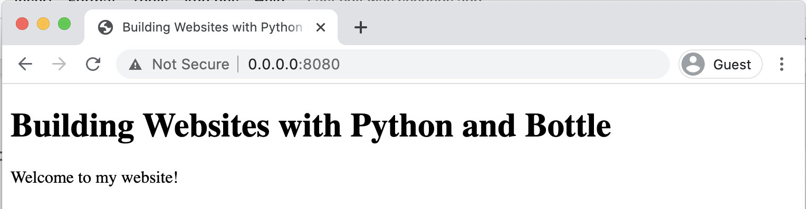

# Starting a Website

Websites built with Python and Bottle aren't too intimidating and many of the concepts will be familiar to you if you have used Python before.

You still write all your website code in HTML and CSS files, the main difference is that instead of loading those files directly in the browser, you use a Python program to read the browser URLs and decide which pages to show.

The Python part of the website is just one file. In this first part of the tutorial we will create that website Python file and add some code to start up a web server.

Steps to starting a website:

- Make a website Python file
- Add the Bottle run command
- Run the website

## Make a website Python file

For websites made with Bottle, you only need one Python file to configure the website. It's possible to add more Python files if you want to, but it isn't required. This Python file will contain a separate function for each page of the website.

The website Python file can be called anything you like, but it's common practice to call it something like **app.py** or **website.py**. The name is only used for running the website from the command line. In this tutorial we'll use the name **website.py**.

Checklist:

- Make a new project folder and open it in your code editor.
- Create a **website.py** file which will run your website and all its pages.

## Install Bottle

Bottle is a Python library that can be installed on your computer using **pip** on the command line. Pip is a **package manager** for Python. A package manager is a program that can install **packages** (you may know them as **libraries**) from the centralized Python package server.

If your Python command is **python3** then your pip command will be **pip3.**

If your Python command is **python** then your pip command will be **pip**.

Install Bottle using the command line:

```bash
pip3 install bottle
```

You should get a confirmation message ending with "**Successfully installed bottle-0.12.19**":

```bash
▶ pip3 install bottle

Collecting bottle
  Using cached bottle-0.12.19-py3-none-any.whl (89 kB)
Installing collected packages: bottle
Successfully installed bottle-0.12.19

```

Checklist:

- Open the command line panel inside Visual Studio Code
- Use pip to install the Bottle library
- Check that you got a success message

## Add the Bottle run command

The Bottle library for Python lets us run a **web server** using our Python file. Running a web server is what makes the website **dynamic** rather than **static**.

In a **static website**, all the files are written using plain HTML and CSS and the website looks the same for every visitor.

In a **dynamic website**, a program is always running in the background (our website.py program!) which can process data and display different things on the website depending on the data entered by the user.

In your **website.py** import the **run** function and pass it values for **host**, **port**, **reloader**, and **debug.**

```python {diff}
from bottle import run

# Start the website
run(host='0.0.0.0', port=8080, reloader=True, debug=True)
```

The **run** function accepts many parameters, but the 4 parameters we are using here are:

<table>
  <tr>
    <td>
      <strong>name</strong>
    </td>
    <td>
      <strong>description</strong>
    </td>
  </tr>
  <tr>
    <td>host</td>
    <td>
      The IP Address of the computer or server where the website is being run
      from. For <strong>localhost</strong> development on your own computer,
      this should be set to <strong>0.0.0.0</strong>
    </td>
  </tr>
  <tr>
    <td>port</td>
    <td>
      The port number where the website should be available. The port number is
      related to the type of connection being used, eg. http usually uses port{" "}
      <strong>80</strong> while https usually uses port <strong>443</strong>.
      For local development of a website, you can choose any 4-digit number you
      like. In this tutorial we will use <strong>8080</strong> which is a common
      choice.
    </td>
  </tr>
  <tr>
    <td>reloader</td>
    <td>
      <strong>True</strong> to make the website automatically reload when you
      save your changes. This only reloads the app in the background, you still
      need to refresh in the browser to see changes.
    </td>
  </tr>
  <tr>
    <td>debug</td>
    <td>
      <strong>True</strong> to show detailed error messages when something goes
      wrong. This is very helpful during development, but should be turned off
      if the website is ever published online, for security reasons.
    </td>
  </tr>
</table>

Notice that the **host** is a string and the **port** is a number. The host name has dots in it, so it needs to be a string with quote marks around it. The port is a plain number so it doesn't need quote marks. It's important to get these two formatted correctly!

This run command will be set up the same way for every website you create with Bottle, and once you've set it up you don't need to change it again. Set and forget!

Checklist:

- Import the **run** function from the **bottle** library
- Configure the **run** function for local development

## Run the website

After the **run** command is configured, you can start up your website!

From the command line, start your website app the same way you would run any other Python app:

```bash
python3 website.py
```

If your website has been configured correctly, you will see a message from Bottle telling you that your website is running and the port and host where it can be accessed.

```bash
▶ python3 website.py

Bottle v0.12.19 server starting up (using WSGIRefServer())...
Listening on http://0.0.0.0:8080/
Hit Ctrl-C to quit.

```

The message "**Listening on http://0.0.0.0:8080/**" is using the **host** and **port** parameters that you passed to the **run **function. This is the URL you can use to view your website in the browser.



_The website can be viewed in the browser at the URL http://0.0.0.0:8080/ but will show a "404 Not Found" error because no pages have been configured yet._

The website runs successfully and an error is shown. The HTTP Error number 404 means "Page not found" and is showing because our website doesn't have any pages added to it yet. In the next step we will add a home page to the project and use it as the default index page of the website.

Checklist:

- Run the **website.py** program from the command line
- Check that you get a 404 Error when you load the website in a web browser
