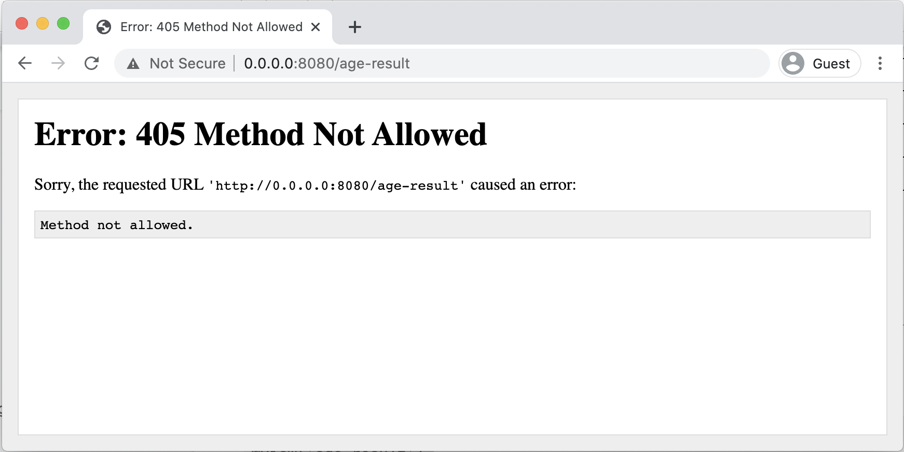
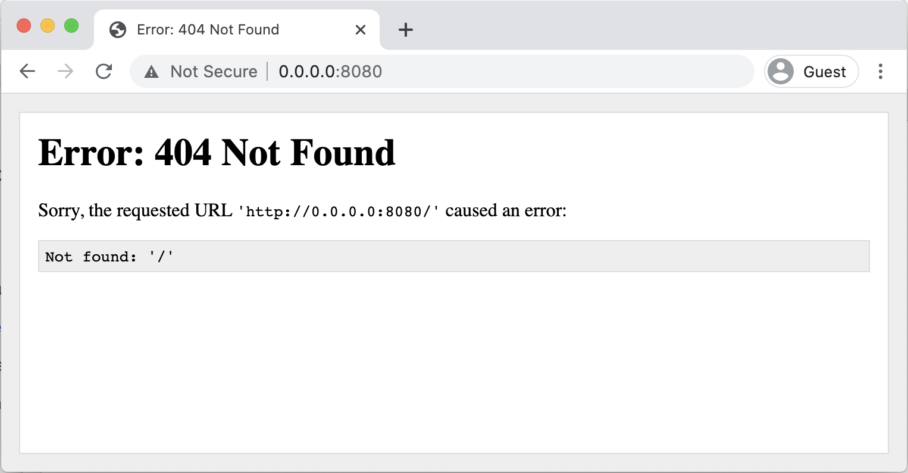

# Create a Home Page

In a website made with Bottle, the HTML files can't be accessed directly from the web browser. Instead, you need to use Python to set up a function for each page in the website. These functions run any code thats required for the page and then display the HTML.

In this part of the tutorial we'll explore how to write one of these page functions for the index page of the app, so we'll create an **index.html** page just like you would for a normal website, but that HTML will be displayed using Python.

The steps to adding a home page are:

- Add an index page function
- Create an index route
- Add an index HTML file
- Display the index HTML

## Add an index page function

The **website.py** file will have one function for every page in the website. The first page we need to add is the **index** page, which is the first page that will be shown when somebody visits the website.

In your **website.py** add a function for the index page and have it return a simple string:

```python {diff}
from bottle import run

+def index():
+    return 'hello!'

# Start the website
run(host='0.0.0.0', port=8080, reloader=True, debug=True)
```

Checklist:

- Add a new function called "index" in your app
- Make the function return a string saying "hello"

##

## Create an index route

Adding a function to the **website.py** is not enough to solve our 404 error. Using Bottle, we need to make it so that when a person goes to the default index page on our website, the index function gets run.

We can create this link by importing the **route** function from Bottle, and then applying the **route** on a new line above the index function:

```python {diff}
from bottle import run, route

+ @route('/')
def index():
    return 'hello!'

# Start the website
run(host='0.0.0.0', port=8080, reloader=True, debug=True)
```

This special **route** function starts with an @ symbol, and it's a type of function known as a **decorator**. A decorator is always used to add some special functionality to a function in your app, and is always used on the line above a function.

In this case the decorator links up the function with a URL path. Decorators are common in many languages, they're not specific to Python. We'll use more decorators\*\* \*\*later in the tutorial.

This process of linking up URL paths with functions is known as **routing**. We are creating a **route** for the default path '/'. In a website you have a **route** for every page of the site.

The '/' route works for someone accessing your website with or without the slash on the end of the url:

<table>
  <tr>
    <td>
      <strong>URL</strong>
    </td>
    <td>
      <strong>route</strong>
    </td>
    <td>
      <strong>function to be run</strong>
    </td>
  </tr>
  <tr>
    <td>http://0.0.0.0:8080</td>
    <td>/</td>
    <td>index</td>
  </tr>
  <tr>
    <td>http://0.0.0.0:8080/</td>
    <td>/</td>
    <td>index</td>
  </tr>
</table>

Now that we have routed the '/' path to the **index()** function, if we visit the index route in the web browser, we will see the output of that function, which is the simple text "hello!":



_Going to http://0.0.0.0:8080 in a web browser will route to the index function and display the text "hello!"._

Checklist:

- Import the **route** function from the Bottle library
- Add the **route** decorator to the index function
- Test the default route in the web browser

## Add an index HTML file

The **index** function only returns some plain text right now, but usually for a website you want to write your pages using HTML. In Bottle, you can write your pages using HTML and then associate them with a particular function.

Create a new file called **index.html** in your project and add some simple HTML code:

```html
<!DOCTYPE html>
<html>
  <head>
    <title>Building Websites with Python and Bottle</title>
  </head>

  <body>
    <h1>Building Websites with Python and Bottle</h1>
    <p>Welcome to my website!</p>
  </body>
</html>
```

Checklist:

- Create an index.html file in your project
- Add some simple HTML content to the file

##

## Display the index HTML

In **website.py** add the **view** decorator to the **index** function. Pass in the name of the index page HTML file, without the .html extension. The **index** function will now have two decorators applied:

```python {diff}
+ from bottle import run, route, view

@route('/')
+ @view('index')
def index():
    return 'hello!'
```

The function also needs to be changed so that it doesn't return a string. If you return a string, then the string will always be displayed instead of the HTML.

Change the **return 'hello!'** of the index function to simply **pass**:

```python {diff}
@route('/')
@view('index')
def index():
-     return 'hello!'
+     pass
```

Now when you load the website you should see the HTML from the index.html displayed:



Notice that because we are using a **web server**, the pages are accessed using custom path names instead of using the name of each HTML file because it's the Python code that serves up the file.

Accessing **http://0.0.0.0:8080/index.html** won't work, but we've configured the index route to load the index.html file in the background and display it when someone goes to the '/' index route.

Checklist:

- Add the **view** decorator to the index function
- Make sure the file name inside the view decorator matches your index.html file name
- Change the index function to **pass** instead of returning a string
