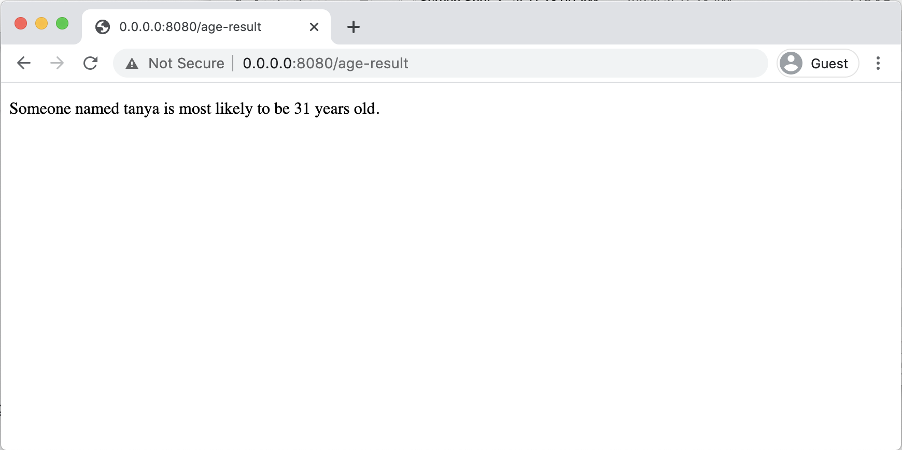
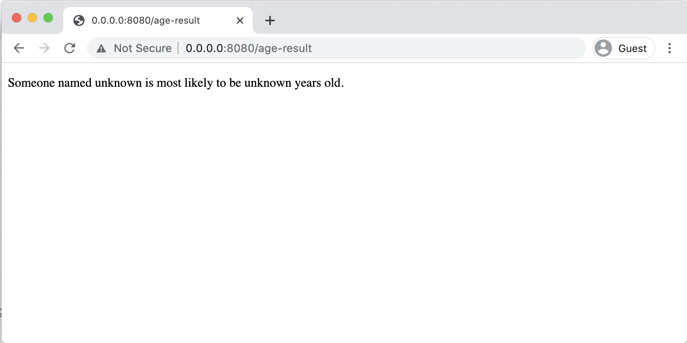
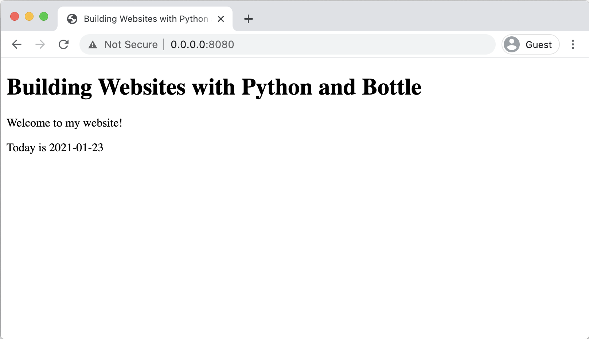
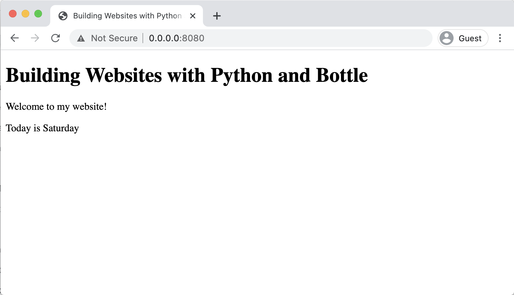

# Display dynamic content

This is the exciting part we've been working towards in this whole tutorial! So far, everything we have created still works just like a normal website. The power of building a website using Python is that you can make it dynamic!

In this part of the tutorial we'll see how to use Python variables in the HTML by displaying the day of the week, which we'll figure out using Python. As part of achieving this goal we'll also look at how dates work in Python and how you can format them for displaying to a user.

The steps will be:

- Use variables in HTML
- Send data to the HTML
- Get today's date
- Format a date in Python
- Display today's day name

## Use variables in HTML

Because we're using Bottle to serve our website, all HTML files can be used as templates. That means that you can directly use variables in any HTML page that is set up using the **@view** decorator.

To try this out, we'll update the index page to display the day of the week.

In **index.html** add a new paragraph to display the day of the week:

```html
<body>
  <h1>Building Websites with Python and Bottle</h1>
  <p>Welcome to my website!</p>

  <p>Today is {{day}}</p>
</body>
```

The part where we want to use a variable is surrounded by two sets of curly brackets. The word in between the curly brackets is the name of the variable you want to display.

If you view this page without the **day** variable set up, you'll get an error 500 Internal Server error, which happens when there is an error in the Python code:



The error specifies that the variable "day" is the problem:

```bash
NameError("name 'day' is not defined")
```

This error is telling you that the variable "day" needs to be sent to the template.

Checklist:

- Add a paragraph to the index.html page
- Use curly brackets and the variable "day" in the HTML
- View the page and check that you get a NameError for "day" not being defined

## Send data to the HTML

To send variables to the HTML page, the function for that page needs to return a **dict** with the variable in it. The word **dict** is short for "dictionary" - it's a

```python
@route('/')
@view('index')
def index():
    return dict(
        day = 'Sunday'
    )

```

Now when you view the page you should see the day displayed:



But of course we don't want to update our website every day to display the correct day of the week, so we need a way to send **dynamic** data to the page.

Checklist:

- Update the index function to return a dictionary
- Add the day to the dictionary as a hard coded string
- Check that the day is displayed in the web browser

## Get today's date

The **index** function is just a normal Python function, so we can add any logic we want inside it. As a first step, we want to get today's real date instead of just hard-coding a day of the week.

We need to import the **date** function from the **datetime** package:

```python
from datetime import date
```

The **date** function can then be used in the **index** function to get today's date and pass it to the HTML:

```python
@route('/')
@view('index')
def index():
    today = date.today()

    data = dict(
        day = 'Monday'
        day = today
    )

    return data
```

This code will show us today's full date, which is a great start!



Checklist:

- Import the date function from the datetime library
- Get today's date in the index function
- Pass today's date to the HTML page

## Format a date in Python

Dates in Python can be formatted as strings using the **strftime** function. The name **strftime **is short for "**str**ing **f**ormat **time**". The **strftime** function takes a string parameter where you can pass in any combination of these codes to create a date in the format you want.

For example this code will display the date as "25 January 2021":

```python
date = date(2021, 1, 25)
formatted_date = date.strftime('%d %B %Y')
print(formatted_date)
```

If we want to use the **today** date in our website to get today's full name, which format code would we use?

<table>
  <tr>
    <td>
      <strong>code</strong>
    </td>
    <td>
      <strong>meaning</strong>
    </td>
    <td>
      <strong>example</strong>
    </td>
  </tr>
  <tr>
    <td>%a</td>
    <td>Weekday as locale’s abbreviated name.</td>
    <td>Mon</td>
  </tr>
  <tr>
    <td>%A</td>
    <td>Weekday as locale’s full name.</td>
    <td>Monday</td>
  </tr>
  <tr>
    <td>%w</td>
    <td>Weekday as a decimal number, where 0 is Sunday and 6 is Saturday.</td>
    <td>1</td>
  </tr>
  <tr>
    <td>%d</td>
    <td>Day of the month as a zero-padded decimal number.</td>
    <td>30</td>
  </tr>
  <tr>
    <td>%-d</td>
    <td>Day of the month as a decimal number. (Platform specific)</td>
    <td>30</td>
  </tr>
  <tr>
    <td>%b</td>
    <td>Month as locale’s abbreviated name.</td>
    <td>Sep</td>
  </tr>
  <tr>
    <td>%B</td>
    <td>Month as locale’s full name.</td>
    <td>September</td>
  </tr>
  <tr>
    <td>%m</td>
    <td>Month as a zero-padded decimal number.</td>
    <td>09</td>
  </tr>
  <tr>
    <td>%-m</td>
    <td>Month as a decimal number. (Platform specific)</td>
    <td>9</td>
  </tr>
  <tr>
    <td>%y</td>
    <td>Year without century as a zero-padded decimal number.</td>
    <td>13</td>
  </tr>
  <tr>
    <td>%Y</td>
    <td>Year with century as a decimal number.</td>
    <td>2013</td>
  </tr>
  <tr>
    <td>%j</td>
    <td>Day of the year as a zero-padded decimal number.</td>
    <td>273</td>
  </tr>
  <tr>
    <td>%-j</td>
    <td>Day of the year as a decimal number. (Platform specific)</td>
    <td>273</td>
  </tr>
  <tr>
    <td>%x</td>
    <td>Locale’s appropriate date representation.</td>
    <td>09/30/13</td>
  </tr>
</table>

_Table adapted from https://strftime.org/ "A quick reference for Python's strftime formatting directives". This table has been simplified to only include "date" formats and leave out "time" formats._

The **locale** is the configured geographic location of the app. Usually there is a default locale for the app and optionally a locale which is specific to the user. The locale matters when you are formatting dates, times or currency for other languages or countries.

Checklist:

- Identify which date format code will give the full day name

## Display today's day name

Using Python's built-in date formatting, we can use the **strftime** function to display the day of the week as a full word. The formatting code for the full day name is **%A**, so this string is passed to the **strftime** function:

```python
@route('/')
@view('index')
def index():
    today = date.today()

    return dict(
        day = today
        day = today.strftime('%A')
    )
```

Now the **day** variable is displayed on the page as the day name, and is calculated each time the page is visited by someone:



Checklist:

- Update the **day** variable to be formatted as the weekday name
- Check that the weekday name is displayed in the browser
