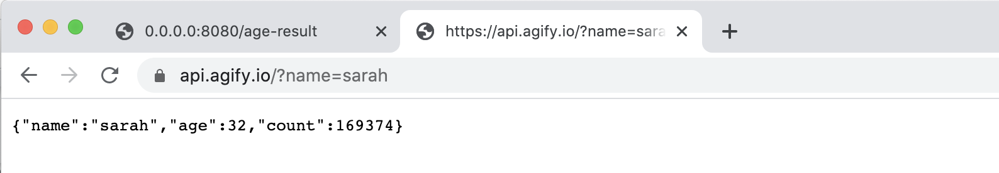
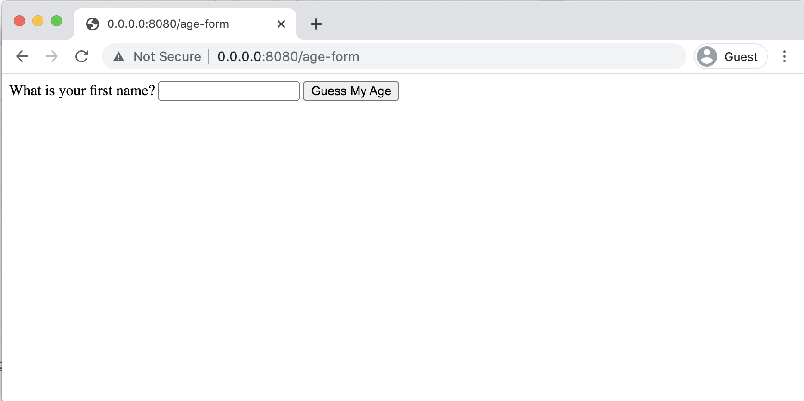
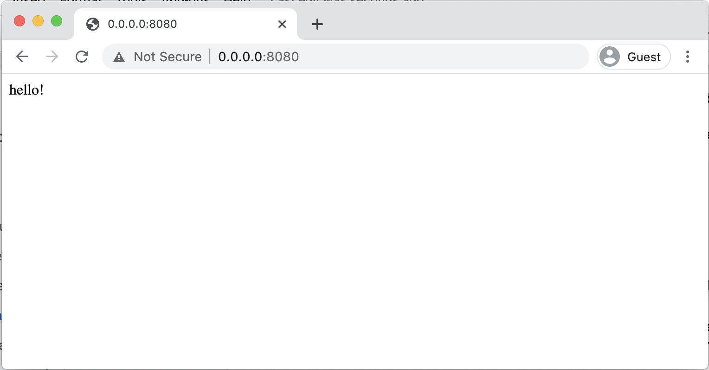
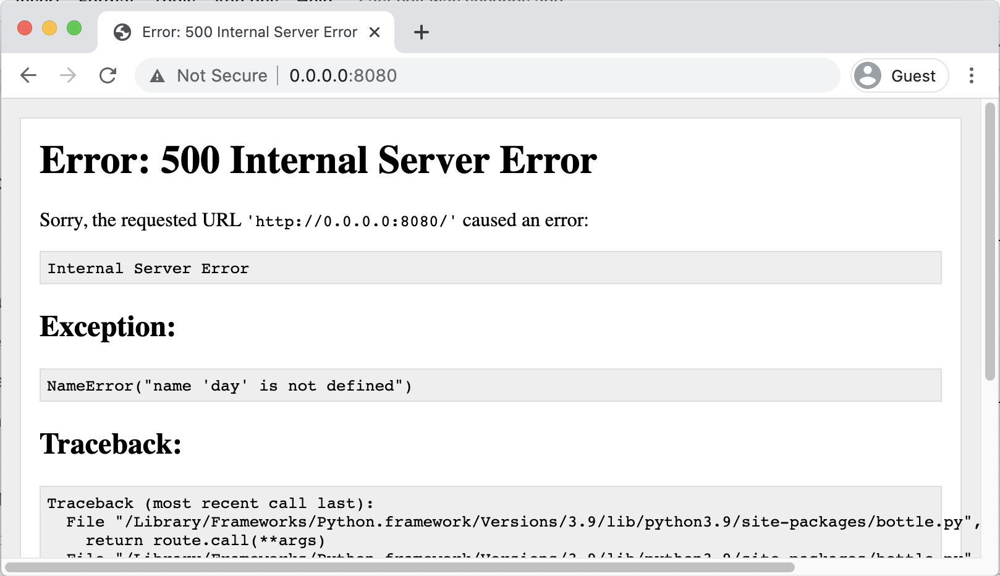
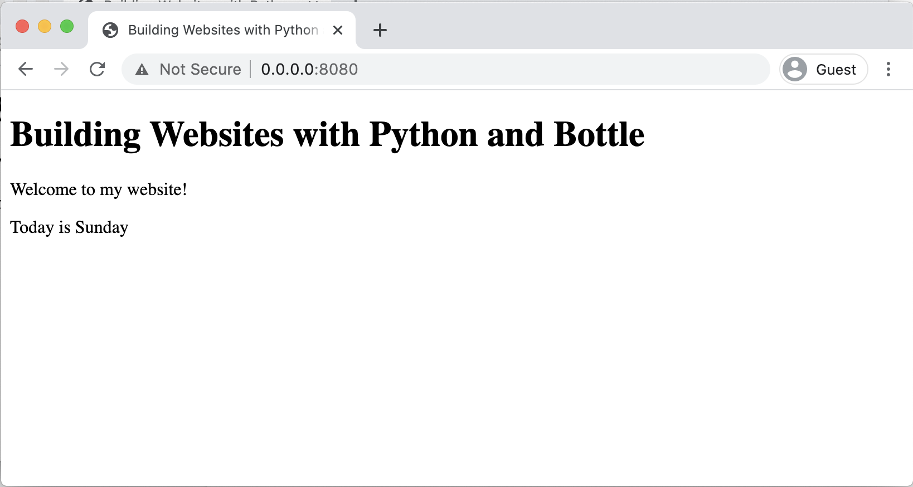

# Guess My Age

We'll use a form to ask a user's name, then use a free API to guess their age. This will require adding two new pages to the website. The first page will be a form where we can ask the person's name, and the second page will be for displaying the result of their estimated age.

In this activity you'll also learn about making HTTP requests using Python and how to process JSON data returned from an API.

The steps will be:

- Create form page HTML
- Add form page route
- Create result page HTML
- Understand the Agify API
- Make an Agify API request

##

## Create form page HTML

The first page we need to create is the form page, where we can ask the user for a name.

Create a new file called **age-form.html** in the project:

```html
<!DOCTYPE html>
<html>
  <body>
    <form action="/age-result" method="POST">
      <label for="name">What is your first name?</label>
      <input name="name" type="text" />

      <button type="submit">Guess My Age</button>
    </form>
  </body>
</html>
```

Checklist:

- Make sure the form action and method are spelled correctly
- Ensure the input element has a name attribute

##

## Add form page route

In **website.py**, add a new route for the "Guess My Age" page:

```python {diff}
@route('/age-form')
@view('age-form')
def age_form():
    pass
```

The page only needs to show the HTML file, it doesn't need to do any processing so the function can just use a **pass**.

Test the page in the browser:



Checklist:

- Create a new route for the age-form page
- Test the page in the web browser

##

## Create result page HTML

This is the page that will be shown to the user after they submit the form. On this page we want a simple template that will display the **name** that was entered and their estimated **age**:

```html
<!DOCTYPE html>
<html>
  <body>
    <p>Someone named {{name}} is most likely to be {{age}} years old.</p>
  </body>
</html>
```

Checklist:

- Create a new page called **age-result.html**
- Add a paragraph to the page using two variables **name** and **age**

##

## Add result page route

This route will need to match the form **action** attribute from the **age-form.html** page. When the form is submitted, the form data will be sent to this route.

Create a route for the page and put in some placeholder data for the **name** and **age** variables.

```python {diff}
@route('/age-result')
@view('age-result')
def age_result():
    return dict(
        name = 'unknown',
        age = 'unknown'
    )
```

View the page to ensure it works correctly:



Checklist:

- Create a new route for the **age-result** page
- Make sure the route name matches the **action** attribute in **age-form.html**
- Return a dictionary containing placeholder values for **name** and **age**
- View the page to ensure it works correctly

## Access the form data

The route needs to be changed to accept form data.

```python {diff}
+ @route('/age-result', method='POST')
@view('age-result')
def age_result():
    return dict(
        name = 'unknown',
        age = 'unknown'
    )
```

After this change, the page can't be accessed directly any more. It **must** be accessed by submitting the form. This makes sure that the page always has the data it needs.



Now that we are using the POST method, we can get the form data.

First, import **request** from the Bottle library:

```python {diff}
from bottle import run, route, view, static_file, request
```

Then use the **request** to get the name value from the submitted form:

```python {diff}
@route('/age-result', method='POST')
@view('age-result')
def age_result():
+     first_name = request.forms.get('name')

    return dict(
-         name = 'unknown',
+         name = first_name,
        age = 'unknown'
    )
```

Checklist:

- Add the **POST** method to the **age-result** route
- Import **request** from Bottle
- Get the **first_name** variable from the submitted form data
- Send the **first_name** to the HTML template

## Understand the Agify API

An API is an **A**pplication **P**rogramming **I**nterface. When any program, application or platform offers a way for developers to interact with it programmatically using code, the set of interactions that are made available are known as the API.

You can visit the home page for the Agify API at **https://agify.io/**

The Agify API is free to use. You send it a name, and it sends back the likely age of a person with that name. The request looks like a simple URL, and the response is in JSON format.

For this particular API, the way you interact with it is using a URL with a "name" parameter:

```
https://api.agify.io?name=YOURNAME
```

You can test this API directly in your web browser by entering the URL and a name:



The data returned by the API request is in JSON format. In the browser it's showing as plain text, but it can also be formatted in this way to make it easier to read:

```json
{
  "name": "sarah",
  "age": 32,
  "count": 169374
}
```

The properties in the response data are fairly simple, but here's a table explaining each of them:

<table>
  <tr>
    <td>
      <strong>property</strong>
    </td>
    <td>
      <strong>description</strong>
    </td>
  </tr>
  <tr>
    <td>name</td>
    <td>The name that was requested</td>
  </tr>
  <tr>
    <td>age</td>
    <td>The estimated age of a person with that name</td>
  </tr>
  <tr>
    <td>count</td>
    <td>The number of people with that name in the database</td>
  </tr>
</table>

Checklist:

- Use the Agify API in a web browser to guess your own age
- Use the Agify API in a web browser to guess the age of someone you know

##

## Make an Agify API request

Install the **requests** library, which makes HTTP requests in Python really easy:

```bash
pip3 install requests
```

Import the requests library:

```python {diff}
import requests
```

Make a **get** request to the Agify API and return the result of the estimated age:

```python {diff}
@route('/age-result', method='POST')
@view('age-result')
def age_result():
    first_name = request.forms.get('name')

+     api_result = requests.get('https://api.agify.io/?name=' + first_name)
+     agify_data = api_result.json()

    return dict(
        name = first_name,
+         age = agify_data['age']
    )
```

And the result should show in the browser:


